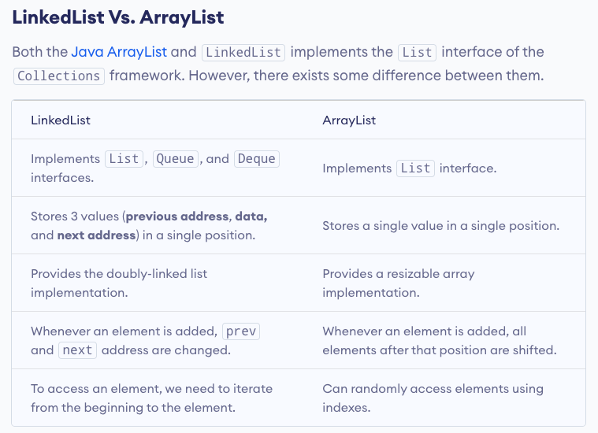

# Vector vs ArrayList

# LinkedList vs ArrayList

# ArrayDeque vs LinkedList

# HashMap vs HashTable

# LinkedHashMap vs HashMap

# EnumSet vs EnumMap

# ConcurrentHashMap vs HashMap

# LinkedHashSet Vs. HashSet

# LinkedHashSet Vs. TreeSet

# TreeSet vs HashSet

# EnumHash: Clonable vs Serializable Interface

# EnumSet: Clonable vs Serializable Interface

# Why ConcurrentHashMap?

# Why HashSet?

# Why EnumSet?

# Abstract Class vs Interface

# Class vs Interface
